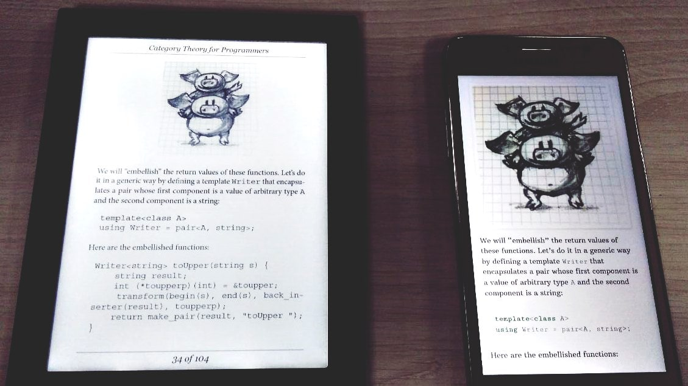

# Category Theory for Programmers [WIP]

This is an e-book version of Bartosz Milewski's [Category Theory for Programmers](https://bartoszmilewski.com/2014/10/28/category-theory-for-programmers-the-preface/) work.

**You can download the latest epub build** [**here**](https://github.com/onlurking/category-theory-for-programmers/releases/download/0.3-alpha/category-theory-for-programmers.epub) (the last chapter is **Monads Categorically**).

## Roadmap

### Part One

- [x] Category: The Essence of Composition
- [x] Types and Functions
- [x] Categories Great and Small
- [x] Kleisli Categories
- [x] Products and Coproducts
- [x] Simple Algebraic Data Types
- [x] Functors
- [x] Functoriality
- [x] Function Types
- [x] Natural Transformations

### Part Two

- [x] Declarative Programming
- [x] Limits and Colimits
- [x] Free Monoids
- [x] Representable Functors
- [x] The Yoneda Lemma
- [x] Yoneda Embedding

### Part Three

- [x] It’s All About Morphisms
- [x] Adjunctions
- [x] Free/Forgetful Adjunctions
- [x] Monads: Programmer’s Definition
- [x] Monads and Effects
- [x] Monads Categorically
- [x] Comonads
- [x] F-Algebras
- [x] Algebras for Monads
- [ ] Ends and Coends
- [ ] Kan Extensions
- [ ] Enriched Categories
- [ ] Topoi
- [ ] Lawvere Theories
- [ ] Monads, Monoids, and Categories 

## Credits

This project is powered by [pandoc](https://pandoc.org/), evangoer's [pandoc-ebook-template
](https://github.com/evangoer/pandoc-ebook-template) and the CSS is somewhat based on [Standard Ebooks](https://standardebooks.org/contribute/a-basic-standard-ebooks-source-folder).

All the credits go to the original [author](https://bartoszmilewski.com/about).

