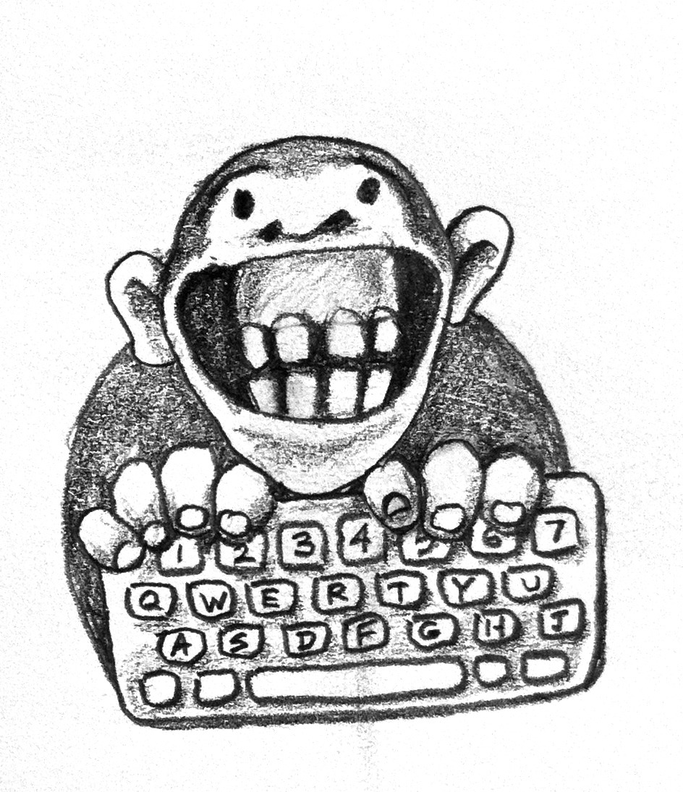

#  Types and Functions 

> This is part of the book Category Theory for Programmers. The previous instalment was [Category: The Essence of Composition](#category-the-essence-of-composition). See the [Table of Contents](#category-theory-for-programmers).

The category of types and functions plays an important role in programming, so let’s talk about what types are and why we need them.

## Who Needs Types?

There seems to be some controversy about the advantages of static vs. dynamic and strong vs. weak typing. Let me illustrate these choices with a thought experiment. Imagine millions of monkeys at computer keyboards happily hitting random keys, producing programs, compiling, and running them.



With machine language, any combination of bytes produced by monkeys would be accepted and run. But with higher level languages, we do appreciate the fact that a compiler is able to detect lexical and grammatical errors. Lots of monkeys will go without bananas, but the remaining programs will have a better chance of being useful. Type checking provides yet another barrier against nonsensical programs. Moreover, whereas in a dynamically typed language, type mismatches would be discovered at runtime, in strongly typed statically checked languages type mismatches are discovered at compile time, eliminating lots of incorrect programs before they have a chance to run.

So the question is, do we want to make monkeys happy, or do we want to produce correct programs?

The usual goal in the typing monkeys thought experiment is the production of the complete works of Shakespeare. Having a spell checker and a grammar checker in the loop would drastically increase the odds. The analog of a type checker would go even further by making sure that, once Romeo is declared a human being, he doesn’t sprout leaves or trap photons in his powerful gravitational field.

## Types Are About Composability

Category theory is about composing arrows. But not any two arrows can be composed. The target object of one arrow must be the same as the source source object of the next arrow. In programming we pass the results on one function to another. The program will not work if the target function is not able to correctly interpret the data produced by the source function. The two ends must fit for the composition to work. The stronger the type system of the language, the better this match can be described and mechanically verified.

The only serious argument I hear against strong static type checking is that it might eliminate some programs that are semantically correct. In practice, this happens extremely rarely and, in any case, every language provides some kind of a backdoor to bypass the type system when that’s really necessary. Even Haskell has `unsafeCoerce`. But such devices should by used judiciously. Franz Kafka’s character, Gregor Samsa, breaks the type system when he metamorphoses into a giant bug, and we all know how it ends.

Another argument I hear a lot is that dealing with types imposes too much burden on the programmer. I could sympathize with this sentiment after having to write a few declarations of iterators in C++ myself, except that there is a technology called type inference that lets the compiler deduce most of the types from the context in which they are used. In C++, you can now declare a variable `auto` and let the compiler figure out its type.

In Haskell, except on rare occasions, type annotations are purely optional. Programmers tend to use them anyway, because they can tell a lot about the semantics of code, and they make compilation errors easier to understand. It’s a common practice in Haskell to start a project by designing the types. Later, type annotations drive the implementation and become compiler-enforced comments.

Strong static typing is often used as an excuse for not testing the code. You may sometimes hear Haskell programmers saying, “If it compiles, it must be correct.” Of course, there is no guarantee that a type-correct program is correct in the sense of producing the right ouput. The result of this cavalier attitude is that in several studies Haskell didn’t come as strongly ahead of the pack in code quality as one would expect. It seems that, in the commercial setting, the pressure to fix bugs is applied only up to a certain quality level, which has everything to do with the economics of software development and the tolerance of the end user, and very little to do with the programming language or methodology. A better criterion would be to measure how many projects fall behind schedule or are delivered with drastically reduced functionality.

As for the argument that unit testing can replace strong typing, consider the common refactoring practice in strongly typed languages: changing the type of an argument of a particular function. In a strongly typed language, it’s enough to modify the declaration of that function and then fix all the build breaks. In a weakly typed language, the fact that a function now expects different data cannot be propagated to call sites. Unit testing may catch some of the mismatches, but testing is almost always a probabilistic rather than a deterministic process. Testing is a poor substitute for proof.

## What Are Types?

The simplest intuition for types is that they are sets of values. The type `Bool` (remember, concrete types start with a capital letter in Haskell) is a two-element set of `True` and `False`. Type `Char` is a set of all Unicode characters like 'a' or 'ą'.

Sets can be finite or infinite. The type of `String`, which is a synonym for a list of `Char`, is an example of an infinite set.

When we declare `x` to be an `Integer`:

```
x :: Integer
```

we are saying that it’s an element of the set of integers. `Integer` in Haskell is an infinite set, and it can be used to do arbitrary precision arithmetic. There is also a finite-set `Int` that corresponds to machine type, just like the C++ `int`.

There are some subtleties that make this identification of types and sets tricky. There are problems with polymorphic functions that involve circular definitions, and with the fact that you can’t have a set of all sets; but as I promised, I won’t be a stickler for math. The great thing is that there is a category of sets, which is called **Set**, and we’ll just work with it. In **Set**, objects are sets and morphisms (arrows) are functions.

**Set** is a very special category, because we can actually peek inside its objects and get a lot of intuitions from doing that. For instance, we know that an empty set has no elements. We know that there are special one-element sets. We know that functions map elements of one set to elements of another set. They can map two elements to one, but not one element to two. We know that an identity function maps each element of a set to itself, and so on. The plan is to gradually forget all this information and instead express all those notions in purely categorical terms, that is in terms of objects and arrows.

In the ideal world we would just say that Haskell types are sets and Haskell functions are mathematical functions between sets. There is just one little problem: A mathematical function does not execute any code — it just knows the answer. A Haskell function has to calculate the answer. It’s not a problem if the answer can be obtained in a finite number of steps — however big that number might be. But there are some calculations that involve recursion, and those might never terminate. We can’t just ban non-terminating functions from Haskell because distinguishing between terminating and non-terminating functions is undecidable — the famous halting problem. That’s why computer scientists came up with a brilliant idea, or a major hack, depending on your point of view, to extend every type by one more special value called the bottom and denoted by `_|_`, or Unicode ⊥. This “value” corresponds to a non-terminating computation. So a function declared as:

```
f :: Bool -> Bool
```

may return `True`, `False`, or `_|_`; the latter meaning that it would never terminate.

Interestingly, once you accept the bottom as part of the type system, it is convenient to treat every runtime error as a bottom, and even allow functions to return the bottom explicitly. The latter is usually done using the expression `undefined`, as in:

```
f :: Bool -> Bool
f x = undefined
```

This definition type checks because `undefined` evaluates to bottom, which is a member of any type, including `Bool`. You can even write:

```
f :: Bool -> Bool
f = undefined
```

(without the `x`) because the bottom is also a member of the type `Bool->Bool`.

Functions that may return bottom are called partial, as opposed to total functions, which return valid results for every possible argument.

Because of the bottom, you’ll see the category of Haskell types and functions referred to as **Hask** rather than **Set**. From the theoretical point of view, this is the source of never-ending complications, so at this point I will use my butcher’s knife and terminate this line of reasoning. From the pragmatic point of view, it’s okay to ignore non-terminating functions and bottoms, and treat **Hask** as bona fide **Set** (see Bibliography at the end).

