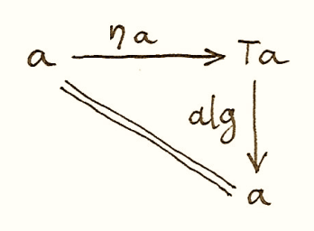
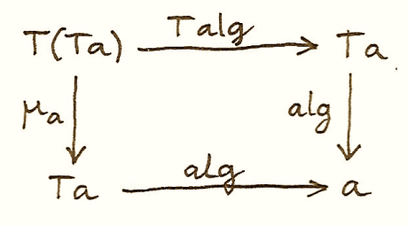

# Algebras for Monads

If we interpret endofunctors as ways of defining expressions, algebras let us evaluate them and monads let us form and manipulate them. By combining algebras with monads we not only gain a lot of functionality but we can also answer a few interesting questions. One such question concerns the relation between monads and adjunctions. As we’ve seen, every adjunction [defines a monad](ch06.md) (and a comonad). The question is: Can every monad (comonad) be derived from an adjunction? The answer is positive. There is a whole family of adjunctions that generate a given monad. I’ll show you two such adjunction.  

Let’s review the definitions. A monad is an endofunctor `m` equipped with two natural transformations that satisfy some coherence conditions. The components of these transformations at `a` are:

<pre>ηa :: a -> m a
μa :: m (m a) -> m a</pre>

An algebra for the same endofunctor is a selection of a particular object — the carrier `a` — together with the morphism:

<pre>alg :: m a -> a</pre>

The first thing to notice is that the algebra goes in the opposite direction to ηa. The intuition is that ηa creates a trivial expression from a value of type `a`. The first coherence condition that makes the algebra compatible with the monad ensures that evaluating this expression using the algebra whose carrier is `a` gives us back the original value:

<pre>alg ∘ ηa = ida</pre>

The second condition arises from the fact that there are two ways of evaluating the doubly nested expression `m (m a)`. We can first apply μa to flatten the expression, and then use the evaluator of the algebra; or we can apply the lifted evaluator to evaluate the inner expressions, and then apply the evaluator to the result. We’d like the two strategies to be equivalent:

<pre>alg ∘ μa = alg ∘ m alg</pre>

Here, `m alg` is the morphism resulting from lifting `alg` using the functor `m`. The following commuting diagrams describe the two conditions (I replaced `m` with `T` in anticipation of what follows):

We can also express these condition in Haskell:

<pre>alg . return = id
alg . join = alg . fmap alg</pre>

Let’s look at a small example. An algebra for a list endofunctor consists of some type `a` and a function that produces an `a` from a list of `a`. We can express this function using `foldr` by choosing both the element type and the accumulator type to be equal to `a`:

<pre>foldr :: (a -> a -> a) -> a -> [a] -> a</pre>

This particular algebra is specified by a two-argument function, let’s call it `f`, and a value `z`. The list functor happens to also be a monad, with `return` turning a value into a singleton list. The composition of the algebra, here `foldr f z`, after `return` takes `x` to:

<pre>foldr f z [x] = x `f` z</pre>

where the action of `f` is written in the infix notation. The algebra is compatible with the monad if the following coherence condition is satisfied for every `x`:

<pre>x `f` z = x</pre>

If we look at `f` as a binary operator, this condition tells us that `z` is the right unit.

The second coherence condition operates on a list of lists. The action of `join` concatenates the individual lists. We can then fold the resulting list. On the other hand, we can first fold the individual lists, and then fold the resulting list. Again, if we interpret `f` as a binary operator, this condition tells us that this binary operation is associative. These conditions are certainly fulfilled when `(a, f, z)` is a monoid.

## T-algebras

Since mathematicians prefer to call their monads `T`, they call algebras compatible with them T-algebras. T-algebras for a given monad T in a category _C_ form a category called the Eilenberg-Moore category, often denoted by CT. Morphisms in that category are homomorphisms of algebras. These are the same homomorphisms we’ve seen defined for F-algebras.

A T-algebra is a pair consisting of a carrier object and an evaluator, `(a, f)`. There is an obvious forgetful functor UT from CT to C, which maps `(a, f)` to `a`. It also maps a homomorphism of T-algebras to a corresponding morphism between carrier objects in C. You may remember from our discussion of adjunctions that the left adjoint to a forgetful functor is called a free functor.

The left adjoint to UT is called FT. It maps an object `a` in C to a free algebra in CT. The carrier of this free algebra is `T a`. Its evaluator is a morphism from `T (T a)` back to `T a`. Since `T` is a monad, we can use the monadic μa (Haskell `join`) as the evaluator.

We still have to show that this is a T-algebra. For that, two coherence conditions must be satisified:

<pre>alg ∘ ηTa = idTa</pre>

<pre>alg ∘ μa = alg ∘ T alg</pre>

But these are just monadic laws, if you plug in `μ` for the algebra.

As you may recall, every adjunction defines a monad. It turns out that the adjunction between FT and UT defines the very monad `T` that was used in the construction of the Eilenberg-Moore category. Since we can perform this construction for every monad, we conclude that every monad can be generated from an adjunction. Later I’ll show you that there is another adjunction that generates the same monad.

Here’s the plan: First I’ll show you that FT is indeed the left adjoint of UT. I’ll do it by defining the unit and the counit of this adjunction and proving that the corresponding triangular identities are satisfied. Then I’ll show you that the monad generated by this adjunction is indeed our original monad.

The unit of the adjunction is the natural transformation:

<pre>η :: I -> UT ∘ FT</pre>

Let’s calculate the `a` component of this transformation. The identity functor gives us `a`. The free functor produces the free algebra (T a, μa), and the forgetful functor reduces it to `T a`. Altogether we get a mapping from `a` to `T a`. We’ll simply use the unit of the monad `T` as the unit of this adjunction.

Let’s look at the counit:

<pre>ε :: FT ∘ UT -> I</pre>

Let’s calculate its component at some T-algebra `(a, f)`. The forgetful functor forgets the `f`, and the free functor produces the pair (T a, μa). So in order to define the component of the counit `ε` at `(a, f)`, we need the right morphism in the Eilenberg-Moore category, or a homomorphism of T-algebras:

<pre>(T a, μa) -> (a, f)</pre>

Such homomorphism should map the carrier `T a` to `a`. Let’s just resurrect the forgotten evaluator `f`. This time we’ll use it as a homomorphism of T-algebras. Indeed, the same commuting diagram that makes `f` a T-algebra may be re-interpreted to show that it’s a homomorphism of T-algebras:

We have thus defined the component of the counit natural transformation `ε` at `(a, f)` (an object in the category of T-algebras) to be `f`.

To complete the adjunction we also need to show that the unit and the counit satisfy triangular identites. These are:

The first one holds because of the unit law for the monad `T`. The second is just the law of the T-algebra `(a, f)`.

We have established that the two functors form an adjunction:

<pre>FT ⊣ UT</pre>

Every adjunction gives rise to a monad. The round trip

<pre>UT ∘ FT</pre>

is the endofunctor in C that gives rise to the corresponding monad. Let’s see what its action on an object `a` is. The free algebra created by FT is (T a, μa). The forgetful functor FT drops the evaluator. So, indeed, we have:

<pre>UT ∘ FT = T</pre>

As expected, the unit of the adjunction is the unit of the monad `T`.

You may remember that the counint of the adjunction produces monadic muliplication through the following formula:

<pre>μ = R ∘ ε ∘ L</pre>

This is a horizontal composition of three natural transformations, two of them being identity natural transformations mapping, respectively, `L` to `L` and `R` to `R`. The one in the middle, the counit, is a natural transformation whose component at an algebra `(a, f)` is `f`.

Let’s calculate the component μa. We first horizontally compose `ε` after FT, which results in the component of `ε` at FTa. Since FT takes `a` to the algebra (T a, μa), and `ε` picks the evaluator, we end up with μa. Horizontal composition on the left with UT doesn’t change anything, since the action of UT on morphisms is trivial. So, indeed, the `μ` obtained from the adjunction is the same as the `μ` of the original monad `T`.

## The Kleisli Category

We’ve seen the Kleisli category before. It’s a category constructed from another category _C_ and a monad `T`. We’ll call this category _CT_. The objects in the Kleisli category _CT_ are the objects of _C_, but the morphisms are different. A morphism fK from `a` to `b` in the Kleisli category corresponds to a morphism `f` from `a` to `T b` in the original category. We call this morphism a Kleisli arrow from `a` to `b`.

Composition of morphisms in the Kleisli category is defined in terms of monadic composition of Kleisli arrows. For instance, let’s compose gK after fK. In the Kleisli category we have:

<pre>fK :: a -> b
gK :: b -> c</pre>

which, in the category _C_, corresponds to:

<pre>f :: a -> T b
g :: b -> T c</pre>

We define the composition:

<pre>hK = gK ∘ fK</pre>

as a Kleisli arrow in _C_

<pre>h :: a -> T c
h = μ ∘ (T g) ∘ f</pre>

In Haskell we would write it as:

<pre>h = join . fmap g . f</pre>

There is a functor `F` from _C_ to _CT_ which acts trivially on objects. On morphims, it maps `f` in _C_ to a morphism in _CT_ by creating a Kleisli arrow that embellishes the return value of `f`. Given a morphism:

<pre>f :: a -> b</pre>

it creates a morphism in _CT_ with the corresponding Kleisli arrow:

<pre>η ∘ f</pre>

In Haskell we’d write it as:

<pre>return . f</pre>

We can also define a functor `G` from _CT_ back to _C_. It takes an object `a` from the Kleisli category and maps it to an object `T a` in _C_. Its action on a morphism fK corresponding to a Kleisli arrow:

<pre>f :: a -> T b</pre>

is a morphism in _C_:

<pre>T a -> T b</pre>

given by first lifting `f` and then applying `μ`:

<pre>μT b ∘ T f</pre>

In Haskell notation this would read:

<pre>G fT = join . fmap f</pre>

You may recognize this as the definition of monadic bind in terms of `join`.

It’s easy to see that the two functors form an adjunction:

<pre>F ⊣ G</pre>

and their composition `G ∘ F` reproduces the original monad `T`.

So this is the second adjunction that produces the same monad. In fact there is a whole category of adjunctions `Adj(C, T)` that result in the same monad `T` on _C_. The Kleisli adjunction we’ve just seen is the initial object in this category, and the Eilenberg-Moore adjunction is the terminal object.

## Coalgebras for Comonads

Analogous constructions can be done for any [comonad](https://bartoszmilewski.com/2017/01/02/comonads/) `W`. We can define a category of coalgebras that are compatible with a comonad. They make the following diagrams commute:

where `coa` is the coevaluation morphism of the coalgebra whose carrier is `a`:

<pre>coa :: a -> W a</pre>

and `ε` and `δ` are the two natural transformations defining the comonad (in Haskell, their components are called `extract` and `duplicate`).

There is an obvious forgetful functor UW from the category of these coalgebras to _C_. It just forgets the coevaluation. We’ll consider its right adjoint FW.

<pre>UW ⊣ FW</pre>

The right adjoint to a forgetful functor is called a cofree functor. FW generates cofree coalgebras. It assigns, to an object `a` in _C_, the coalgebra (W a, δa). The adjunction reproduces the original comonad as the composite FW ∘ UW.

Similarly, we can construct a co-Kleisli category with co-Kleisli arrows and regenerate the comonad from the corresponding adjunction.

## Lenses

Let’s go back to our discussion of lenses. A lens can be written as a coalgebra:

<pre>coalgs :: a -> Store s a</pre>

for the functor `Store s`:

<pre>data Store s a = Store (s -> a) s</pre>

This coalgebra can be also expressed as a pair of functions:

<pre>set :: a -> s -> a
get :: a -> s</pre>

(Think of `a` as standing for “all,” and `s` as a “small” part of it.) In terms of this pair, we have:

<pre>coalgs a = Store (set a) (get a)</pre>

Here, `a` is a value of type `a`. Notice that partially applied `set` is a function `s->a`.

We also know that `Store s` is a comonad:

<pre>instance Comonad (Store s) where
  extract (Store f s) = f s
  duplicate (Store f s) = Store (Store f) s</pre>

The question is: Under what conditions is a lens a coalgebra for this comonad? The first coherence condition:

<pre>εa ∘ coalg = ida</pre>

translates to:

<pre>set a (get a) = a</pre>

This is the lens law that expresses the fact that if you set a field of the structure `a` to its previous value, nothing changes.

The second condition:

<pre>fmap coalg ∘ coalg = δa ∘ coalg</pre>

requires a little more work. First, recall the definition of `fmap` for the `Store` functor:

<pre>fmap g (Store f s) = Store (g . f) s</pre>

Applying `fmap coalg` to the result of `coalg` gives us:

<pre>Store (coalg . set a) (get a)</pre>

On the other hand, applying `duplicate` to the result of `coalg` produces:

<pre>Store (Store (set a)) (get a)</pre>

For these two expressions to be equal, the two functions under `Store` must be equal when acting on an arbitrary `s`:

<pre>coalg (set a s) = Store (set a) s</pre>

Expanding `coalg`, we get:

<pre>Store (set (set a s)) (get (set a s)) = Store (set a) s</pre>

This is equivalent to two remaining lens laws. The first one:

<pre>set (set a s) = set a</pre>

tells us that setting the value of a field twice is the same as setting it once. The second law:

<pre>get (set a s) = s</pre>

tells us that getting a value of a field that was set to `s` gives `s` back.

In other words, a well-behaved lens is indeed a comonad coalgebra for the `Store` functor.

## Challenges

1.  What is the action of the free functor F :: C -> CT on morphisms. Hint: use the naturality condition for monadic `μ`.
2.  Define the adjunction:

    <pre>UW ⊣ FW</pre>

3.  Prove that the above adjunction reproduces the original comonad.

## Acknowledgment

I’d like to thank Gershom Bazerman for helpful comments.

